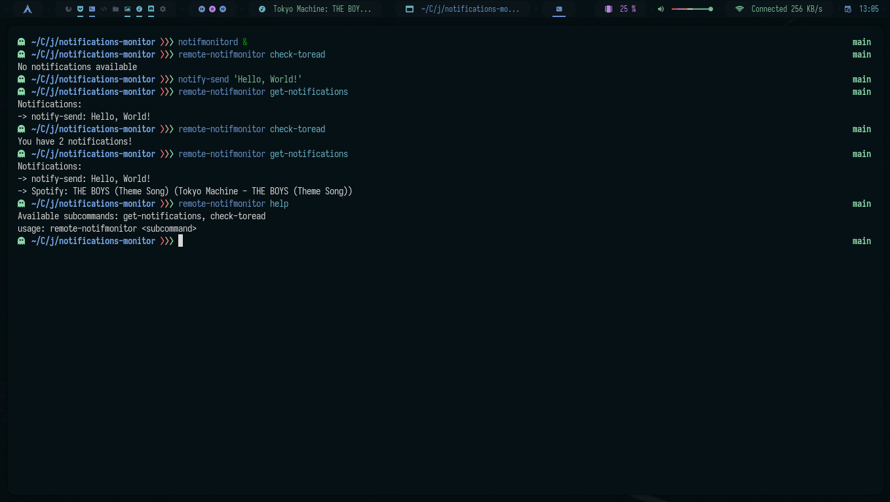

# Notifications Monitor

Monitor your notifications and get a temporary list of the notifications.



## Installation

You can install this using these commands:

```sh
git clone https://github.com/AlphaTechnolog/notification-monitor.git notifications-monitor
cd notifications-monitor
./bin/install.sh
```

> You might need to provide the root password for installation

## Usage

First in a terminal start the daemon with the `notifmonitord` launcher (it's autoinstalled in `/usr/bin`):

```sh
notifmonitord &
```

> If the VERBOSE config variable is true, the daemon can't be executed in the background :v

> VERBOSE is false by default. To change it, modify the file `notifications-monitor/src/daemon/index.js` and then reinstall

In a second terminal, you can get the details of the notifications using the `remote-notifmonitor` launcher, that is autoinstalled too:

### Get help

```sh
remote-notifmonitor help
```

### Get notifications list

```sh
remote-notifmonitor get-notifications
```

### Get number of notifications only

```sh
remote-notifmonitor check-toread
```
